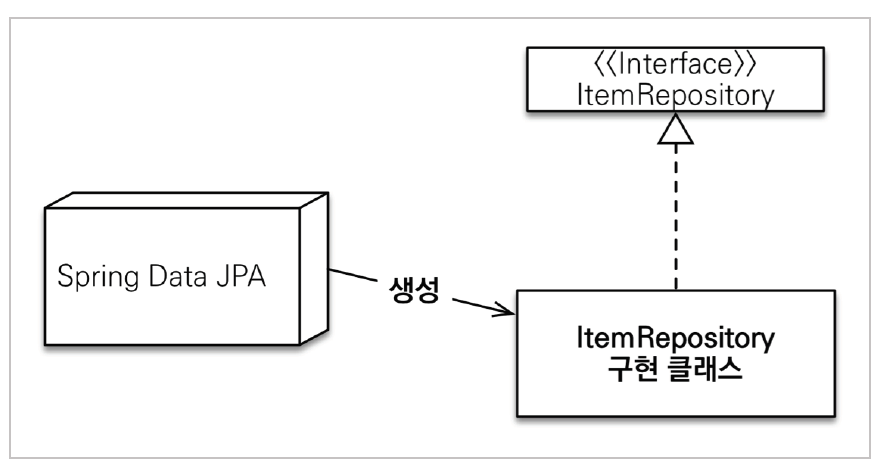
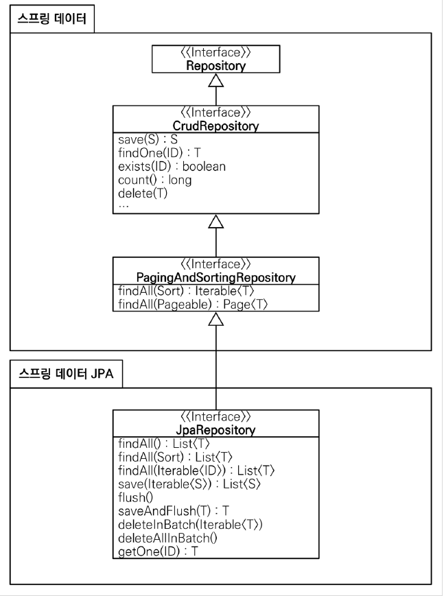

## 라이브러리 살펴보기

```
./gradlew dependencies --configuration compileClasspath
```

### 라이브러리 간단 요약

- spring-boot-start-web
    - spring-boot-starter-tomcat : 톰캣(웹서버)
    - spring-webmvc : 스프링 웹 MVC
- spring-boot-starter-data-jpa
    - spring-boot-starter-aop
    - spring-boot-starter-jdbc
        - HikariCP : 커넥션 풀
    - hibernate + JPA : 하이버네이트, JPA
    - spring-data-jpa : 스프링 데이터 JPA

- spring-boot-starter : 스프링 부트 + 스프링 코어 + 로깅
    - spring-boot
        - spring-core
    - spring-boot-starter-logging
        - logback, slf4j

### 테스트 라이브러리

- spring-boot-starter-test
    - junit : 테스트 프레임워크, junit5(jupiter) 사용
        - 과거 버전은 vintage
    - mockito : 목 라이브러리
    - assertJ : 테스트 코드 작성을 도와주는 라이브러리
    - spring-test : 스프링 통합 테스트 지원


### 외부 라이브러리

```
implementation 'com.github.gavlyukovskiy:p6spy-spring-boot-starter:1.5.7'
```

`PreparedStatement`를 `Statement`로 바꿔 로그를 찍어주는 라이브러리

## Spring Data JPA 동작



- `org.springframework.data.repository.Repository`를 구현한 클래스는 스캔 대상이다.

- `@Autowired ItemRepository`를 사용하여 DI 받으면, 주입되는 객체는 Spring Data JPA가 생성한 `프록시 객체`이다. 애플리케이션 로딩 시점에 객체를 생성해서 주입해준다.

- `@Repository`를 생략할 수 있다.

**사용 예시**

```java
public interface MemberRepository extends JpaRepository<Member, Long>{ }
```

## 공통 인터페이스 분석



`Spring Data`라는 프로젝트 안에 Spring-Data-JPA가 존재한다. Spring-Data-JPA는 RDBMS에 대한 ORM 프레임워크지만, NoSQL에서도 사용되는 공통 기능들이 있다. 그런 공통 기능들은 `Spring Data`에 정의되어있다.

### 주요 메서드

- `save(S)` : 새로운 엔티티는 저장하고 이미 있는 엔티티는 병합한다.
- `delete(T)` : 엔티티 하나를 삭제한다. 내부에서 EntityManager.remove() 호출
- `findById(ID)` : 엔티티 하나를 조회한다. 내부에서 EntityManager.find() 호출
- `getOne(ID)` : 엔티티를 프록시로 조회한다. 내부에서 EntityManager.getReference() 호출
- `findAll(…)` : 모든 엔티티를 조회한다. 정렬( Sort )이나 페이징( Pageable ) 조건을 파라미터로 제공할 수 있다.

<br><hr>

## 쿼리 메소드

### 메소드 이름으로 쿼리 생성

Spring 데이터 JPA는 메서드 이름을 분석해서 JPQL을 생성한다.

**예시 코드**

```java
public interface MemberRepository extends JpaRepository<Member, Long> {
    List<Member> findByUsernameAndAgeGreaterThan(String username, int age);
}
```

[스프링 데이터 JPA 공식 문서 참고](https://docs.spring.io/spring-data/jpa/docs/current/reference/html/#jpa.query-methods.query-creation)

#### 스프링 데이터 JPA가 제공하는 쿼리 메소드 기능

- `조회` : find…By ,read…By ,query…By get…By,
    - [참고](https://docs.spring.io/spring-data/jpa/docs/current/reference/html/#repositories.query-methods.query-creation)
    - 예:) findHelloBy 처럼 ...에 식별하기 위한 내용(설명)이 들어가도 된다.
- `COUNT` : count…By 반환타입 long
- `EXISTS`: exists…By 반환타입 boolean
- `삭제` : delete…By, remove…By 반환타입 long
- `DISTINCT` : findDistinct, findMemberDistinctBy
- `LIMIT` : findFirst3, findFirst, findTop, findTop3
    - [참고](https://docs.spring.io/spring-data/jpa/docs/current/reference/html/#repositories.limit-query-result)

참고: 이 기능은 엔티티의 필드명이 변경되면 인터페이스에 정의한 메서드 이름도 꼭 함께 변경해야 한다.
그렇지 않으면 애플리케이션을 시작하는 시점에 오류가 발생한다.
> 이렇게 애플리케이션 로딩 시점에 오류를 인지할 수 있는 것이 스프링 데이터 JPA의 매우 큰 장점이다.

### JPA NamedQuery

**예시 코드**

```java
@Entity
@NamedQuery(
name="Member.findByUsername",
query="select m from Member m where m.username = :username")
public class Member {
...
}


public interface MemberRepository extends JpaRepository<Member, Long> { //** 여기 선언한 Member 도메인 클래스
    @Query(name = "Member.findByUsername") //생략가능
    List<Member> findByUsername(@Param("username") String username);
}
```

- 매개변수는 `org.springframework.data.repository.query.Param` 즉, `@Param`으로 받는다.

- `NamedQuery`는 정적 쿼리이므로 로딩 시점에 SQL로 파싱한다. 따라서 로딩시점에 오류를 잡아줄 수 있다.

- Entity에 쿼리를 생성해두는 것 자체가 번거롭고 별로 좋아보이진 않는다. ORM.xml을 사용할 수는 있다해도, 레포지토리에 쿼리를 직접 정의하는 기능에 비하면 별로 좋지 않다.

### @Query 레포지토리 메소드에 쿼리 정의하기

**예시 코드**

```java
public interface MemberRepository extends JpaRepository<Member, Long> {
    @Query("select m from Member m where m.username= :username and m.age = :age")
    List<Member> findUser(@Param("username") String username, @Param("age") int age);
}
```

- 이름이 없는 `NamedQuery`라고도 볼 수 있다.
- **JPA Named 쿼리처럼 애플리케이션 실행 시점에 문법 오류를 발견할 수 있다.(매우 큰 장점!)**

> 실무에서는 간단한 기능은 메서드 이름을 이용해서 쿼리를 자동 생성하고, 메서드 이름이 복잡해지는 쿼리들은 @Query를 이용해 직접 정의해 사용한다.

<br><hr>

## DTO로 조회하기

**예시 코드**

```java
public interface MemberRepository extends JpaRepository<Member, Long>{
    @Query("select m.username from Member m")
    List<String> findUsernameList();
	
    @Query("select new com.study.datajpa.dto.MemberDto(m.id, m.username,t.name) from Member m join m.team t")
    List<MemberDto> findMemberDto();
}
```

- JPA 값 타입 객체(`@embedded`)도 조회가 가능하다.
- DTO로 직접 조회하는 경우에는 `new` 명령어를 사용한다.

<br><hr>

## 파라미터 바인딩

**예시 코드**

```java
@Query("select m from Member m where m.username in :names")
List<Member> findByNames(@Param("names") List<String> names);
```

- `@Param("names")`처럼 이름 기반의 파라미터 바인딩을 사용하자.

<hr>

## 반환 타입

스프링 데이터 JPA는 유연한 반환 타입을 지원한다.

**예시 코드**

```java
List<Member> findByUsername(String name); //컬렉션
Member findByUsername(String name); //단건
Optional<Member> findByUsername(String name); //단건 Optional
```

- 단건 조회의 경우, 데이터가 없으면 Null을 반환한다. JPA에서는 `NoResultException` 예외를 터뜨리는데, Spring Data JPA에서는 try-catch를 사용해 Null을 반환하도록 만들었다.

- 단건 조회에서 결과가 2개 이상인 경우, `NonUniqueResultException`이 발생한다. `Spring`에서는 `IncorrectResultSizeDataAccessException` 라는 예외로 변경한다. `Repository`의 기술은 JPA 말고도 Mongo 등 다양한 기술이 될 수 있기 때문에, 서비스 계층에서 `JPA`에 의존하지 않고 `Spring`에 의존하도록 하기 위함이다.

<br><hr>

## 페이징과 정렬

### 페이징과 정렬 파라미터

- `org.springframework.data.domain.Sort` : 정렬 기능
- `org.springframework.data.domain.Pageable` : 페이징 기능 (내부에 sort 포함)

### 특별한 반환 타입

- `org.springframework.data.domain.Page` : 추가 count 쿼리를 포함하는 페이징
- `org.springframework.data.domain.Slice` : 추가 count 쿼리 없이 다음 페이지만 확인 가능한 페이징 (내부적으로 limit+1을 조회하여, 다음 페이지가 있는지 확인할 수 있게 해준다.)

- `List(Java Collection)` : 추가 count 없이 결과만 반환

**사용 예시**
```java
Page<Member> findByUsername(String name, Pageable pageable); //count 쿼리 사용
Slice<Member> findByUsername(String name, Pageable pageable); //count 쿼리 사용 안함
List<Member> findByUsername(String name, Pageable pageable); //count 쿼리 사용 안함
List<Member> findByUsername(String name, Sort sort);
```

```java
//페이징 조건과 정렬 조건 설정
@Test
public void page() throws Exception {
    //given
    memberRepository.save(new Member("member1", 10));
    memberRepository.save(new Member("member2", 10));
    memberRepository.save(new Member("member3", 10));
    memberRepository.save(new Member("member4", 10));
    memberRepository.save(new Member("member5", 10));
    //when
    PageRequest pageRequest = PageRequest.of(0, 3, Sort.by(Sort.Direction.DESC,
    "username"));
    Page<Member> page = memberRepository.findByAge(10, pageRequest);
    //then
    List<Member> content = page.getContent(); //조회된 데이터
    assertThat(content.size()).isEqualTo(3); //조회된 데이터 수
    assertThat(page.getTotalElements()).isEqualTo(5); //전체 데이터 수
    assertThat(page.getNumber()).isEqualTo(0); //페이지 번호
    assertThat(page.getTotalPages()).isEqualTo(2); //전체 페이지 번호
    assertThat(page.isFirst()).isTrue(); //첫번째 항목인가?
    assertThat(page.hasNext()).isTrue(); //다음 페이지가 있는가?
}
```

- 두 번째 파라미터인 `Pageable`은 인터페이스이고, `org.springframework.data.domain.PageRequest`는 구현 클래스이다. 실제 사용할 때는 `PageRequest`를 사용한다.

- `PageReuqest`는 `(페이지 번호, 조회할 데이터 수, 정렬 조건[선택사항])`을 넘겨줄 수 있다. **조심해야 할 점은 페이지 번호가 0부터 시작한다는 점이다.**

<br>

### Page 인터페이스와 Slice 인터페이스

```java
public interface Page<T> extends Slice<T> {
    int getTotalPages(); //전체 페이지 수
    long getTotalElements(); //전체 데이터 수
    <U> Page<U> map(Function<? super T, ? extends U> converter); //변환기
}

public interface Slice<T> extends Streamable<T> {
    int getNumber(); //현재 페이지
    int getSize(); //페이지 크기
    int getNumberOfElements(); //현재 페이지에 나올 데이터 수
    List<T> getContent(); //조회된 데이터
    boolean hasContent(); //조회된 데이터 존재 여부
    Sort getSort(); //정렬 정보
    boolean isFirst(); //현재 페이지가 첫 페이지 인지 여부
    boolean isLast(); //현재 페이지가 마지막 페이지 인지 여부
    boolean hasNext(); //다음 페이지 여부
    boolean hasPrevious(); //이전 페이지 여부
    Pageable getPageable(); //페이지 요청 정보
    Pageable nextPageable(); //다음 페이지 객체
    Pageable previousPageable();//이전 페이지 객체
    <U> Slice<U> map(Function<? super T, ? extends U> converter); //변환기
}
```

<br>

### count쿼리 직접 작성하기

Paging을 사용하면 count를 세는 쿼리가 발생한다고 언급했다. 만약, `Paging` 대상 엔티티가 수차례 Join을 사용한다면, count 쿼리 또한 Join을 사용하게 된다. 하지만 count를 세는 모든 경우에 Join 쿼리가 필요하지는 않다. 만약 join없이 count를 셀 수 있는 상황이라면 직접 작성하는 것이 성능에 좋다. **실무에서는 매우 중요하다!!**

**예시 코드**

```java
@Query(value = "select m from Member m",
        countQuery = "select count(m.username) from Member m")
Page<Member> findMemberAllCountBy(Pageable pageable);
```

<br>

### 페이지를 유지하면서 엔티티를 DTO로 변환하기

**예시 코드**

```java
Page<Member> page = memberRepository.findByAge(10, pageRequest);
Page<MemberDto> dtoPage = page.map(m -> new MemberDto());
```

<br><hr>

## 벌크성 수정 쿼리

JPA는 `Dirty Checking`으로 수정을 할 수 있지만, 수정해야 할 엔티티가 많다면 네트워크 트래픽이 너무 심해진다. 따라서 한 번의 쿼리로 수정할 수 있는 기능을 제공한다.

**예시 코드**

```java
@Modifying
@Query(value = "update Member m set m.age = m.age + 1 where m.age >= :age")
int bulkUpdateAge(@Param("age") int age);
```

- `@Modifying` 애노테이션을 사용하지 않으면 Spring data JPA는 기본적으로 `getSingleResult()`, `getResultList()`가 호출되기 때문에 예외가 발생한다.

**테스트 코드**

```java
@Test
public void bulkUpdate() {
    Member m1 = new Member("AAA", 10, null);
    Member m2 = new Member("BBB", 20, null);
    Member m3 = new Member("CCC", 30, null);
    
    memberRepository.save(m1);
    memberRepository.save(m2);
    memberRepository.save(m3);
    
    int successCount = memberRepository.bulkUpdateAge(20);
    
    assertThat(successCount).isEqualTo(2);
    
    //
    Member findMember = memberRepository.findByUsername("BBB");
    assertThat(findMember.getAge()).isEqualTo(21);
    
}
```

- 이 테스트는 실패해야 정상이다.

- bulk 연산은 영속성 컨텍스트를 거치지 않고 DB에 바로 쿼리가 전달된다. 따라서 영속성 컨텍스트에는 나이의 증가가 반영되지 않은 엔티티가 관리되고 있기 때문에, DB와 영속성 컨텍스트의 결과가 다른 상태가 된다.

- 이 문제를 해결하기 위해서는 `em.clear()`를 호출해줘야 한다. `EntityManager`는 동일한 트랜잭션 내라면 다 똑같은 `EntityManager`를 사용하게 된다. `em.flush()`를 호출하지 않는 이유는 bulk 연산은 JPQL이므로 default로 `em.flush()`를 호출한다. 

- `em.clear()`를 명시적으로 호출할 수도 있지만, `@Modifying(clearAutomatically = true)`를 사용하면 자동으로 영속성 컨텍스트를 비워준다.

**참고: 벌크 연산은 영속성 컨텍스트를 무시하고 실행하기 때문에, 영속성 컨텍스트에 있는 엔티티의 상태와 DB에 엔티티 상태가 달라질 수 있다.**

- 권장하는 방안

> 1. 영속성 컨텍스트에 엔티티가 없는 상태에서 벌크 연산을 먼저 실행한다.
> 2. 부득이하게 영속성 컨텍스트에 엔티티가 있으면 벌크 연산 직후 영속성 컨텍스트를 초기화 한다.

<br><hr>

## Fetch Join , @EntityGraph

페치 조인은 연관된 객체를 한 번에 조회해오는 기능으로 성능최적화에 아주 많이 쓰이는 기능이다.

**예시 코드**

```java
//1. @Query에 직접 명시하기.
@Query("select m from Member m join fetch m.team")
List<Member> findMemberFetchJoin();

//2. @EntityGraph로 Fetch Join하기.
@EntityGraph(attributePaths={"team"})
@Query("select m from Member m")
List<Member> findMemberEntityGraph();

//3. 공통 메서드 오버라이드
@Override
@EntityGraph(attributePaths={"team"})
List<Member> findAll();

//4. 메서드 이름으로 생성되는 쿼리에 @EntityGraph 사용하기
@EntityGraph(attributePaths={"team"})
List<Member> findByUsername(String username)
```

- 쿼리가 짧은 경우에는 4번을 주로 사용하고, 쿼리가 긴 경우에는 1번 처럼 직접 명시하는 편이 더 낫다.

- `@EntityGraph`는 단순히 Fetch Join(Left outer join)을 해주는 기능이다.


<br><hr>

## JPA Hint

JPA 쿼리 힌트는 SQL 힌트가 아니라 JPA의 구현체에게 제공하는 힌트를 의미한다. Hibernate가 제공하는 기능을 사용할 때 쓸 수 있다.

**예시 코드**

```java
@QueryHints(@QueryHint(name = "org.hibernate.readOnly", value = "true"))
Member findReadOnlyByUsername(String username)
```

- QueryHint로 readOnly를 Hibernate에게 전달하면, 해당 엔티티는 영속성 컨텍스트에 스냅샷을 찍어두지 않는다. 스냅샷을 찍는 행위는 사실상, 객체를 복사해서 저장해두는 것이기 때문에 메모리를 절약할 수 있다.

- Service 계층에서 `@Transaction(readOnly=true)`로 설정해두면 스냅샷을 찍어두지도 않고, `Dirty Checking`도 하지 않는다.

<hr>

## Lock

데이터베이스의 Lock을 JPA에서 편하게 사용할 수 있게 지원해준다.

**예시 코드**

```java
@Lock(LockModeType.PESSIMISTIC_WRITE)
List<Member> findByUsername(String username)
```

- Lock은 클라이언트에 의해 동시에 변경될 여지가 있다면 이론적으로 걸어두는 것이 맞다. 하지만, 그럴 가능성이 매우 낮거나 치명적이지 않다면 Lock을 걸지 않는 편이 더 낫다. Lock을 걸면 트래픽이 많을 경우 데이터베이스의 성능이 급격하게 낮아질 수 있기 때문이다. Lock은 항상 최후의 보루로 생각하자.

<br><hr>

## Custom Repository

JPA Repository는 인터페이스만 정의하고, 구현체는 Spring Data JPA가 제공하는 구조다. 하지만, 상황에 따라서 인터페이스의 메서드를 직접 구현해야 할 때도 있다. 예를 들면, 동적쿼리를 작성해야 할 때 직접 작성하는 것이 좋다. 이때, Spring Data JPA가 제공하는 기본 메서드는 그대로 활용하면서 필요한 메서드만 직접 정의하는 방법을 살펴보자.

**예시 코드**

```java
//사용자 레파지토리 인터페이스 정의
public interface MemberRepositoryCustom{
    List<Member> findMemberCustom();
}

//사용자 레파지토리 인터페이스 구현 (반드시 레파지토리 이름 + Impl을 붙여줘야 한다.)
@RequirementArgsConstructor
public class MemberRepositoryCustomImpl implements MemberRepositoryCustom{
    private final EntityManager em;

    @Override
    public List<Member> findMemberCustom(){
        return em.createQuery("select m from Member m")
                .getResultList();
    }
}

//사용자 레파지토리 인터페이스 상속
public interface MemberRepository extends JpaRepository<Member, Long>, MemberRepositoryCustom{
}

//사용자 정의 메서드 호출
List<Member> result = memberRepository.findMemberCustom();
```

스프링 데이터 JPA가 인식해서 스프링 빈으로 등록해준다.

>참고 : 항상 사용자 정의 레파지토리가 필요한 것은 아니다. 화면을 위한 Dto를 조회하는 쿼리들의 저장소를 만들고싶다면 MemberQueryRepository와 같이 클래스를 직접 정의하고 스프링 빈으로 등록해서 사용해도 된다. 이 경우에는 스프링 데이터 JPA와는 전혀 무관한 레파지토리가 된다.

<br><hr>

## Auditing

엔티티를 생성,변경할 때 변경한 사람과 시간을 추적하고 싶을 때 사용한다.

JPA만을 사용할 때는 다음과 같다.

**순수 JPA**

```java
@Getter
@MappedSuperClass
public class BaseEntity{

    @Column(updatable=false)
    private LocalDateTime createdDate;
    private LocalDateTime updatedDate;

    @PrePersist
    public void prePersist(){
        LocalDateTime now = LocalDateTime.now();
        createdDate = now;
        updatedDate = now;
    }

    @PreUpdate
    public void preUpdate(){
        updatedDate = LocalDateTime.now();
    }
}

public class Member extends BaseEntity {}
```

주요 애노테이션

- @PrePersist, @PostPersist
- @PreUpdate, @PostUpdate

**스프링 데이터 JPA**

- `@EnableJpaAuditing`을 스프링 부트 설정 클래스에 적용한다.
- `@EntityListners(AuditingEntityListener.class)` 엔티티에 적용한다.

사용 애노테이션

- `@CreatedDate`
- `@LastModifiedDate`
- `@CreatedBy`
- `@LastModifiedBy`


```java
@EntityListners(AuditingEntityListener.class)
@MappedSuperClass
@Getter
public class BaseTimeEntity{

    @CreatedDate
    @Column(updatable = false)
    private LocalDateTime createdDate;

    @LastModifiedDate
    private LocalDateTime lastModifiedDate;
}

@EntityListners(AuditingEntityListener.class)
@MappedSuperClass
@Getter
public class BaseEntity extends BaseTimeEntity{

    @CreatedBy
    @Column(updatable = false)
    private LocalDateTime createdBy;

    @LastModifiedBy
    private LocalDateTime lastModifiedBy;
}

//AuditorAware를 빈으로 등록해줘야 한다.
@Configuration
public class JpaConfig{

    @Bean
    public AuditorAware<String> auditorProvider(){
        //...
    }
}

//Security를 사용한다면 AuditorAware의 구현체를 빈으로 등록한다.
@Component
public class LoginUserAuditorAware  implements AuditorAware<String> {
    @Override
    public Optional<String> getCurrentAuditor() {
        Authentication authentication = SecurityContextHolder.getContext().getAuthentication();
        if (null == authentication || !authentication.isAuthenticated()) {
            return null;
        }
        User user = (User) authentication.getPrincipal();
        return Optional.of(user.getUserId());
    }
}
```

- `@EntityListeners(AuditingEntityListener.class)`를 생략하고 이벤트를 엔티티 전체에 적용하려면 orm.xml에 다음과 같이 등록하면 된다.

```xml
<?xml version=“1.0” encoding="UTF-8”?>
<entity-mappings xmlns="http://xmlns.jcp.org/xml/ns/persistence/orm" xmlns:xsi="http://www.w3.org/2001/XMLSchema-instance" xsi:schemaLocation="http://xmlns.jcp.org/xml/ns/persistence/orm http://xmlns.jcp.org/xml/ns/persistence/orm_2_2.xsd" version="2.2">
    <persistence-unit-metadata>
        <persistence-unit-defaults>
            <entity-listeners>
                <entity-listener class="org.springframework.data.jpa.domain.support.AuditingEntityListener"/>
            </entity-listeners>
        </persistence-unit-defaults>
    </persistence-unit-metadata>
</entity-mappings>
```

<br><hr>


## Web 확장 - 도메인 클래스 컨버터

HTTP 파라미터로 넘어온 엔티티의 아이디로 엔티티를 찾아서 바인딩

```java

@RequiredArgsConstructor
public class MemberController{
    private final MemberRepository memberRepository;

    @GetMapping("/members/{id}")
    public String findMember(@PathVariable("id") Member member){
        return member.getName();
    }
}
```

- HTTP 요청은 회원 id를 받지만 도메인 클래스 컨버터가 중간에 동작하여 회원 엔티티 객체를 반환한다. 도메인 클래스 컨버터도 레파지토리를 이용해서 회원을 찾기 때문에 성능상의 이점은 없다. (추천되는 방법은 아니다.)

- 도메인 클래스 컨버터로 엔티티를 파라미터로 받으면, 이 엔티티는 단순 조회용으로만 사용해야 한다.(트랜잭션이 없는 범위에서 엔티티를 조회했으므로, 엔티티를 변경해도 DB에 반영되지 않는다.)

<br><hr>

## Web 확장 - 페이징과 정렬

스프링 데이터가 제공하는 페이징과 정렬 기능을 스프링 MVC에서 편리하게 사용할 수 있다.

**사용 예시**

```java
@GetMapping("/members")
public Page<MemberDto> list(@PageableDefault(size = 5) Pageable pageable){
    Page<Member> page = memberRepository.findAll(pageable);
    return page.map(MemberDto::new));
}
```

파라미터로 `Pageable`을 받을 수 있다. 매개변수가 바인딩 될때, `org.springframework.data.domain.PageRequest` 객체가 생성되어 주입된다. 

**요청 파라미터 예시**

`/members?page=0&size=3&sort=id,desc&sort=username,desc`

- page : 현재 페이지, **0부터 시작함에 주의하자.**
- size : 한 페이지에 노출할 데이터 건수
- sort : 정렬조건을 정의한다. 여러개 사용할 수 있다.

**페이지 글로벌 설정**

```properties
spring.data.web.pageable.default-page-size=20 /# 기본 페이지 사이즈/
spring.data.web.pageable.max-page-size=2000 /# 최대 페이지 사이즈/
```

<br>

### 페이징 정보가 둘 이상인 경우

```java
public String list(
@Qualifier("member") Pageable memberPageable,
@Qualifier("order") Pageable orderPageable, ...
```

`/members?member_page=0&order_page=1` 요청하면 각각 다른 페이지를 불러올 수 있다.

<br>

### 페이지 번호 1부터 시작하기

1. Pageable과 Page를 직접 정의해서 사용한다.

2. `spring.data.web.pageable.one-indexed-parameters=true`로 설정한다. 
- 이 방법은 web에서 페이지 파라미터를 -1 처리하는 것이 전부다. 따라서 Json의 `pageable`에는 페이지번호가 잘못나오는 문제가 발생한다.

가급적이면 page 시작 번호를 0으로 두고 쓰자. 상황이 어쩔 수 없다면 한계를 이해하고 2번을 채택해도 된다.


